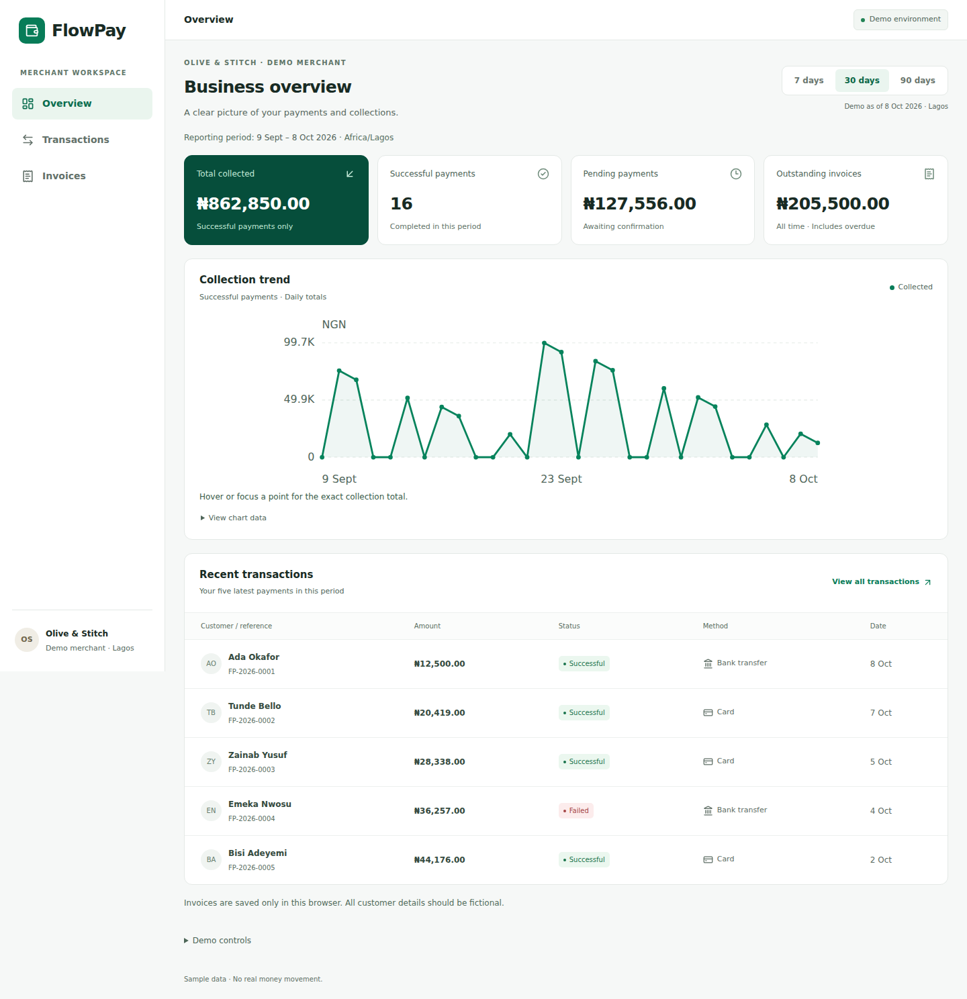
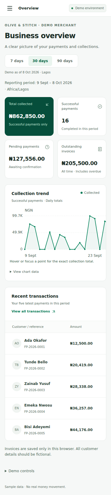

# FlowPay

A portfolio demo of a Nigerian merchant payments dashboard for **Olive & Stitch**, a fictional business. Explore payment reporting, transaction search and invoice workflows in a responsive interface built with Next.js and TypeScript.

**Demo environment:** all financial and customer data is fictional. There are no real payments, credentials, authentication, external databases or money movement. Use fictional details when creating invoices.

**[Open the live demo](https://flowpay-swart.vercel.app)** · [Source on GitHub](https://github.com/Peter-Aderinto/flowpay)

## Screenshots

Captured from the actual application running a local production build, with the original seeded dataset.





## Features

- **Overview:** 7-, 30- and 90-day reporting, successful collections, pending payments, all-time outstanding invoices, a keyboard-accessible collection chart with an exact data table, and recent transactions.
- **Transactions:** customer/email/reference search, status and payment-method filters, inclusive Lagos date ranges, date/amount sorting, and pagination. URL parameters retain filters on refresh and browser Back/Forward. Details include copy-reference feedback and linked invoice previews.
- **Invoices:** search, paid/unpaid/overdue filters, previews and validated multi-item invoice creation with optional notes. Created invoices survive reloads in the visitor's browser.
- **PDF invoices:** browser-generated A4 downloads with selectable text, embedded naira-capable typography, wrapped descriptions and notes, repeated table headings across pages, exact totals and the current demo status. PDF code and font load on demand. Downloading never marks an invoice paid.
- **Interaction states:** loading, empty, error/retry and storage-recovery notices. Demo controls simulate empty and one-shot error responses without erasing saved data; a confirmed reset restores the seed dataset.
- **Responsive layouts:** desktop tables and mobile records, labelled forms, visible keyboard focus, modal focus containment/restoration, and reduced-motion support.

## Stack and local setup

Next.js **16.4** App Router, React **19.3**, strict TypeScript, Tailwind CSS **4**, ESLint **9**, Lucide icons and jsPDF. npm and `package-lock.json` provide reproducible dependency installation. The PDF's locally hosted DejaVu Sans font includes its [redistribution notice](public/fonts/LICENSE-DejaVu.txt).

Use **Node.js 24.x**, matching the declared package engine and intended Vercel runtime.

```bash
npm ci
npm run dev
```

Open **http://localhost:3000**. `/` redirects to `/dashboard`; `/transactions` and `/invoices` also support direct visits. No environment variables or service credentials are required.

To run a normal production build locally:

```bash
npm run build
npm start
```

## Architecture and mock service

The UI calls typed services in `src/lib/mock-api.ts`. These are **simulated asynchronous responses using promises and a short delay, not real HTTP payment requests**. The service filters and sorts before pagination and supports cancellation. Request keys and abort cleanup keep stale responses from replacing newer selections. UI components do not import fixtures directly.

`src/lib/repository.ts` owns a shared, versioned browser dataset at localStorage key **`flowpay.demo.v1`**. First-time visitors automatically receive **60 transactions and six invoices**. Valid saved datasets are preserved. Invalid or incompatible data is replaced with the original seeds and a recovery notice. If storage is blocked or full, the session continues in memory with a warning that changes may be lost on reload. Subscribers and storage events refresh relevant views after changes.

**Created invoices remain in the visitor's browser/profile and origin.** They are not uploaded to GitHub or a server. Invoices created on localhost will not automatically appear on a deployed domain; browser storage is origin-specific. Clearing site data or confirming Reset demo data removes created invoices. Different visitors receive their own independent dataset.

| Location | Responsibility |
| --- | --- |
| `src/app/(merchant)` | Route metadata and shared dashboard layout |
| `src/components` | Dashboard, filters, dialogs, forms, previews and request states |
| `src/lib/types.ts`, `fixtures.ts`, `demo.ts` | Typed data, deterministic seeds and demo clock |
| `src/lib/analytics.ts`, `transaction-query.ts` | Reporting, query parsing, sorting and pagination |
| `src/lib/money.ts`, `invoices.ts`, `format.ts` | Integer-kobo validation, statuses and NGN/Lagos formatting |
| `src/lib/repository.ts`, `mock-api.ts` | Browser persistence and asynchronous mock services |
| `src/lib/invoice-pdf.ts` | On-demand, selectable-text PDF generation |
| `tests` | Financial rules, validation, persistence, query and PDF tests |

## Financial rules and fixed demo date

The interface is frozen at **8 October 2026, end of day in Africa/Lagos (UTC+01:00)**. The date is displayed on the pages; it does not advance with the visitor's clock. Seeded transactions cover **11 July–8 October 2026**.

Amounts are stored and calculated as **integer kobo**, then formatted as NGN. Successful transactions alone contribute to collected totals and charts; pending totals exclude successful and failed payments. Outstanding invoices include all unpaid and overdue invoices regardless of the selected reporting window.

New invoices are stored as unpaid. An unpaid invoice with a due date before 8 October appears overdue; one due on 8 October remains unpaid through that day's end. Paid seed invoices have linked full successful sample payments. PDF and preview status use the same rules. Missing issue dates, addresses, tax details or payment instructions are not invented.

## Verification

```bash
npm run lint
npm run typecheck
npm test
npm run build
```

The automated suite covers collection/status rules, Lagos boundaries, query parsing and combined filters, sorting/pagination, exact monetary calculations, invoice validation, dataset integrity, persistence/recovery, unavailable storage, cancellation, resets, and PDF filenames/layout/source-data preservation.

To verify without replacing a running development preview's `.next` output:

```bash
FLOWPAY_DIST_DIR=.next-verify npm run build
FLOWPAY_DIST_DIR=.next-verify npm start -- --port 3100
```

This override is for local verification only. **Do not configure `FLOWPAY_DIST_DIR` on Vercel**; production uses the normal Next.js `.next` output.

The release was checked in Chromium against the local production build: direct routes and refreshes, automatic seeding, transaction filters, invoice creation/reload persistence, PDF downloads, desktop/mobile navigation and page overflow at 375, 768 and 1440 pixels. Screenshots above come from that build. These local checks do not establish that an unverified deployment works.

## Deployment

This is an ordinary Next.js project suitable for Vercel's Next.js preset with repository root `.` and Node.js **24.x**. Use `npm ci` for installation and `npm run build` for the build; retain the default output directory. No payment secrets, database provisioning or paid services are required.

Deployed to **https://flowpay-swart.vercel.app** in the account's Hobby workspace. Vercel's GitHub integration is connected to `Peter-Aderinto/flowpay`; pushes to `main` trigger production deployments. The initial release was deployed successfully from a GitHub push, and the production domain was checked without Vercel login cookies or bypass headers. Live Chromium checks passed for `/`, `/dashboard`, `/transactions`, and `/invoices`, including direct visits/refreshes, transaction filters, automatic seeds, invoice creation/reload persistence, and seeded/new PDF downloads. No console or page errors were observed during those checks.

## Limitations and dependency review

This is a single-browser portfolio demo, not a production financial system. It has no authentication, multi-user synchronization, refunds, partial payments, tax, discounts or real invoice payment flow. Concurrent browser-tab writes are not database transactions. Browser download settings determine where PDFs are saved. Automated and Chromium checks do not replace broader assistive-technology and cross-browser testing.

The 9 October 2026 audit reports **five high-severity affected package entries in one ESLint tooling chain**, stemming from a stack-exhaustion advisory in `braces`. The production-only audit reports zero vulnerabilities. No compatible patched dependency is available; npm's proposed Next ESLint v14 downgrade was not applied. Tooling/CI disruption from malicious nested glob patterns remains relevant. See the [dependency review](docs/dependency-review.md) for the exact path, exposure, reproduction commands and follow-up.
